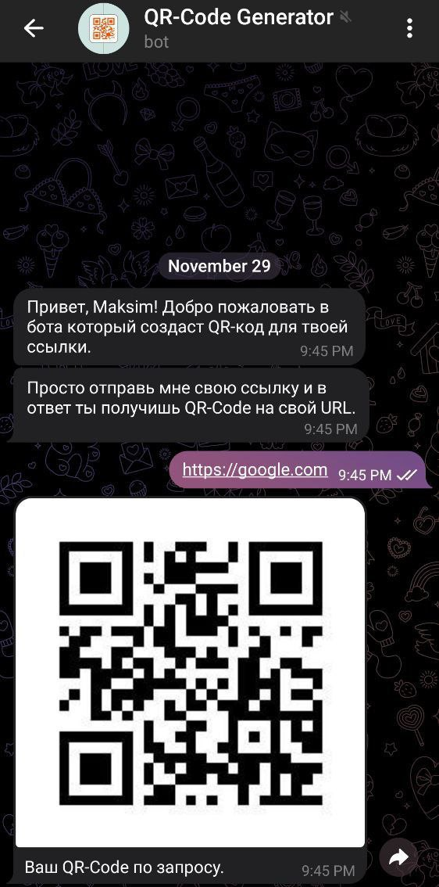

    <h1>QR-Code Bot</h1>
    
    
QR-Code Bot - это Telegram-бот, который создает QR-коды для предоставленных пользователем URL. 
    Просто отправьте боту свою ссылку, и в ответ получите QR-код для этого URL.

## Как использовать

1. Начните диалог с ботом, отправив ему команду `/start`.
2. Бот приветствует вас и предоставляет инструкции по использованию.
3. Отправьте боту свою ссылку, и в ответ вы получите QR-код.

    
    

## Пример

1. Пользователь отправляет боту `/start`.
2. Бот приветствует пользователя и предоставляет инструкции.
3. Пользователь отправляет свою ссылку, например, `https://www.example.com`.
4. Бот создает QR-код для предоставленного URL.
5. Бот отправляет пользователю изображение QR-кода.
